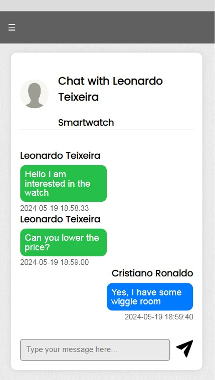

# FEUP-REUSE

## Group ltw02g04

- David Carvalho (up202208654) 33.3%
- Diogo Vieira (up202208723) 33.3%
- Leonardo Magalhães (up202208726) 33.3%

## Install Instructions

    git clone git@github.com:FEUP-LTW-2024/ltw-project-2024-ltw02g04.git
    git checkout final-delivery-v1
    php -S localhost:9000

## Screenshots

## Implemented Features

**General**:

- [ ] Register a new account.
- [ ] Log in and out.
- [ ] Edit their profile, including their name, username, password, and email.

**Sellers**:

- [ ] List new items, providing details such as category, brand, model, size, and condition, along with images.
- [ ] Track and manage their listed items.
- [ ] Respond to inquiries from buyers regarding their items and add further information if needed.
- [ ] Print shipping forms for items that have been sold.

**Buyers**:

- [ ] Browse items using filters like category, price, and condition.
- [ ] Engage with sellers to ask questions or negotiate prices.
- [ ] Add items to a wishlist and shopping cart.
- [ ] Proceed to checkout with their shopping cart (simulate payment process).

**Admins**:

- [ ] Elevate a user to admin status.
- [ ] Introduce new item categories, sizes, conditions, and other pertinent entities.
- [ ] Oversee and ensure the smooth operation of the entire system.

**Security**:
We have been careful with the following security aspects:

- [ ] **SQL injection**
- [ ] **Cross-Site Scripting (XSS)**
- [ ] **Cross-Site Request Forgery (CSRF)**
- [ ] **Password Storage Mechanism**: hash_password&verify_password

**Aditional Requirements**:

We also implemented the following additional requirements:

- [ ] **Rating and Review System**
- [ ] **Real-Time Messaging System**

## Credentials

| USER | ADMIN |
| -------- | -------- |
| username: neymito   | username: paicris |
| password: 12345678  | password: 12345678 |
